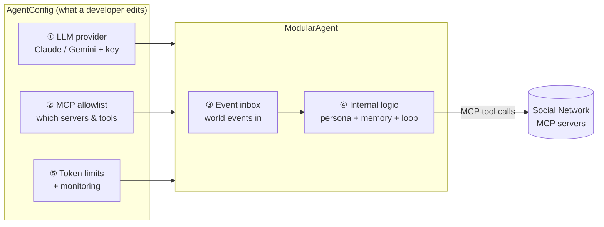
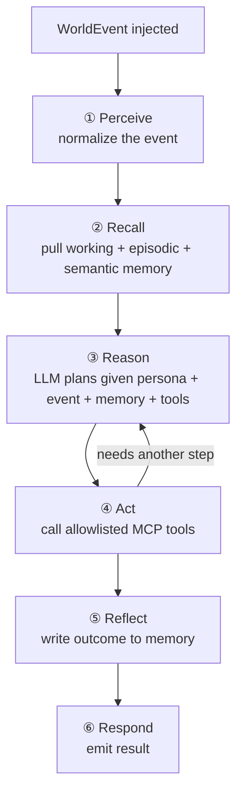
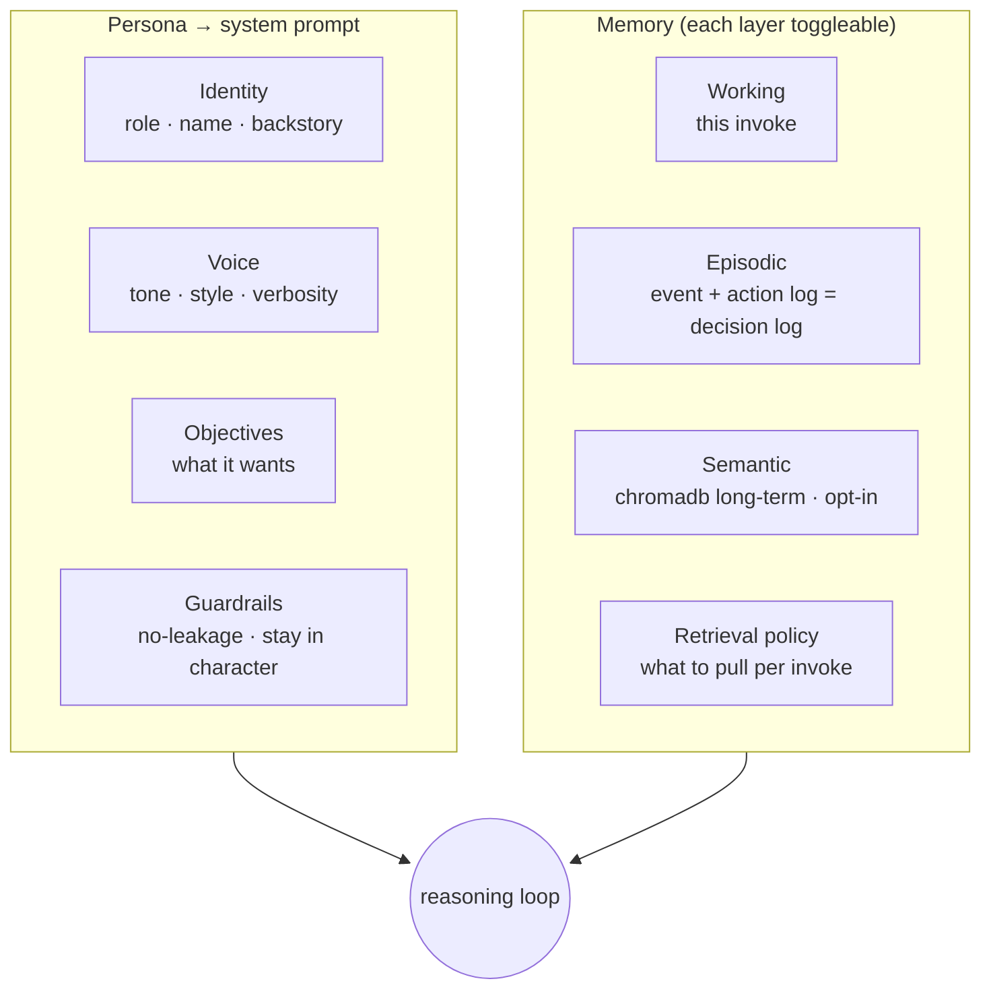
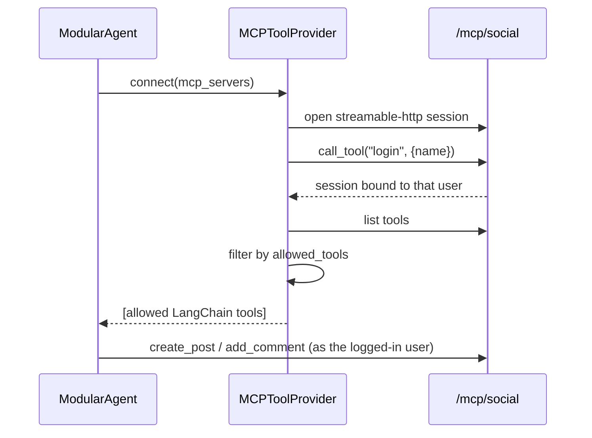

# modular-agent — Developer Guide

A reusable **LangChain agent baseline** for the BitriX / HappyTuna crisis simulation. You build a
concrete agent (customer, influencer, CEO, …) by *configuring* this baseline and shaping its persona
and memory — not by rewriting the plumbing each time.

> **Status:** this guide describes the intended API from [PLAN.md](../PLAN.md). Track build progress
> in [TASKS.md](../TASKS.md).

---

## 1. The five modules at a glance



| # | Module | You configure… | Lives in |
|---|--------|----------------|----------|
| ① | **LLM provider** | provider (`claude`/`gemini`), model, API key | `llm/factory.py` |
| ② | **MCP tool allowlist** | which MCP servers + which tool names | `tools/mcp_client.py` |
| ③ | **World-event injection** | how events get pushed in | `events/` |
| ④ | **Internal logic** | persona (role/tone/voice) + memory layers | `persona/`, `memory/`, `loop/` |
| ⑤ | **Token limits + monitoring** | hard budget + live dashboard | `monitor/` |

---

## 2. Quickstart

```bash
cd modular-agent
python -m venv .venv && source .venv/bin/activate   # Windows: .venv\Scripts\activate
pip install -r requirements.txt
cp .env.example .env        # then set ANTHROPIC_API_KEY
```

Minimal agent in code:

```python
import asyncio
from modular_agent import AgentConfig, MCPServerConfig, ModularAgent, WorldEvent
from modular_agent.persona import Persona, Identity, Voice, Objectives
from modular_agent.tools import MCPToolProvider

config = AgentConfig(
    provider="claude",
    model="claude-haiku-4-5",          # default — fast & cheap; swap freely
    token_budget=50_000,               # ⑤ hard cap for the whole run
    mcp_servers={                      # ② allowlist
        "social": MCPServerConfig(
            url="http://localhost:3005/mcp/social",
            requires_login=True, login_name="Dana (loyal customer)",
            allowed_tools=["login", "get_global_feed", "search", "create_post", "add_comment"],
        ),
    },
)

persona = Persona(                     # ④ who the agent is
    identity=Identity(name="Dana", role="loyal HappyTuna customer of 10 years"),
    voice=Voice(tone="warm but worried", verbosity="concise"),
    objectives=Objectives(items=["Protect your family", "Stay loyal unless trust breaks"]),
)

async def main():
    agent = ModularAgent(config, persona)
    async with MCPToolProvider(config.mcp_servers).connect() as tools:
        with agent.monitor.live():     # ⑤ rich live dashboard
            result = await agent.run(
                WorldEvent(type="news_article", source="news-site",
                           payload={"headline": "Contamination rumor hits HappyTuna"}),
                tools=tools,
            )
    print(result.output)

asyncio.run(main())
```

Or run the ready-made demo:

```bash
python examples/demo_customer_agent.py
```

---

## 3. The reasoning loop (Module ④)

Every `agent.run(event)` walks the same six explicit stages. Each stage is an overridable method, so
a specialized agent can customize one without touching the rest.



- **Reason ↔ Act** is LangChain 1.x's `create_agent` tool-calling loop (LangGraph-backed), bounded
  by `config.max_iterations` so it can't run away.
- The surrounding stages (Perceive / Recall / Reflect / Respond) are the baseline's own methods, each
  overridable on a subclass.

### Internal logic, broken down



---

## 4. MCP tool allowlist (Module ②)

The Social Network exposes two Streamable-HTTP MCP servers. You declare which servers and which tools
your agent may use; everything else is filtered out before the LLM sees it.

| Server | URL (from host) | Auth | Typical tools |
|--------|-----------------|------|---------------|
| `/mcp/social` | `http://localhost:3005/mcp/social` | `login` once per session | `create_post`, `add_comment`, `like_post`, `get_global_feed`, `search` |
| `/mcp/analytics` | `http://localhost:3005/mcp/analytics` | none | `get_overview`, `get_sentiment_timeline`, `get_trends` |



> Inside Docker Compose, use `http://social-network:3000/mcp/...` instead of `localhost:3005`.

---

## 5. Token limits & the live dashboard (Module ⑤)

`token_budget` is a **hard cap**: the monitor tracks cumulative usage and aborts *before* starting a
call once the budget is spent (a clean `TokenBudgetExceeded`, not an overrun). While the agent runs,
`agent.monitor.live()` renders a terminal dashboard:

```text
+------------------------- modular-agent monitor --------------------------+
|  invoke  inv-3   model claude-haiku-4-5                                  |
|  tokens  in 1,240  out 380  (1,620 this invoke)                          |
|    cost  cumulative $0.0121                                              |
|  budget  [####--------]  38,380 / 50,000 left  (warn)                    |
|   steps  2 LLM calls | 3 tool calls                                      |
|   tools  create_post x1  get_global_feed x2 (all ok)                     |
| latency  4.2s invoke | 0.6s slowest tool                                 |
|  errors  none                                                            |
|   trace  perceive -> recall -> reason -> act:get_global_feed -> reason   |
|          -> act:create_post -> reflect -> respond                        |
+--------------------------------------------------------------------------+
```

_(Glyphs are ASCII so the dashboard renders identically on every console, including legacy
Windows terminals.)_

Everything shown is also available as a structured `RunMetrics` object (`agent.monitor.metrics`) — the
dashboard is just one renderer, so a web UI could consume the same data later.

---

## 6. Building your own agent

1. **Pick a model** — set `provider` + `model` (default `claude-haiku-4-5`; bump to
   `claude-sonnet-5` / `claude-opus-4-8` for harder reasoning).
2. **Scope its tools** — list only the MCP tools the persona should use.
3. **Shape the persona** — fill in Identity / Voice / Objectives; keep the default Guardrails (they
   enforce the simulation's no-leakage / stay-in-character rules).
4. **Choose memory layers** — working + episodic are on by default. Semantic (chromadb) long-term
   memory is opt-in and must be constructed explicitly, then passed in via a `MemoryBundle`:

   ```python
   from modular_agent.memory import MemoryBundle, SemanticMemory

   # Offline: bring your own embedder. Or set use_default_embedder=True to use
   # chromadb's built-in embedder (downloads a ~80MB model on first use).
   semantic = SemanticMemory(embedding_function=my_embedder)      # local & offline
   memory = MemoryBundle(semantic=semantic)
   agent = ModularAgent(config, persona, memory=memory)
   ```

   Nothing hits the network unless you opt in.
5. **Set a budget** — pick `token_budget` per run and watch the dashboard.
6. **Feed events** — push `WorldEvent`s via the `EventInbox` (or pass one directly to `agent.run`).

See [`examples/demo_customer_agent.py`](../examples/demo_customer_agent.py) for a complete worked
example.
