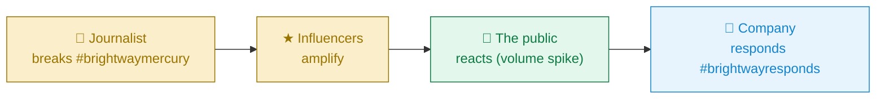
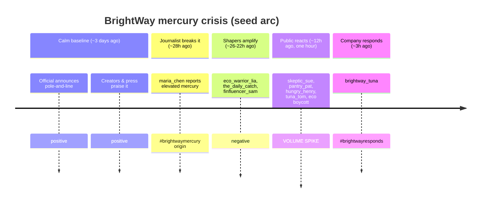

# Phase 6 — Narrative Shapers

**Status:** ✅ Implemented (2026-06-24) · Related: [`PLAN.md`](./PLAN.md) · [`TASKS.md`](./TASKS.md) · [`analytics-methodology.md`](./analytics-methodology.md) · [`architecture.md`](./architecture.md)

This phase delivers on the project owner's standing wish — *"have some of the users be
influencers or journalists that shape the narrative"* — by lighting up the `accountType` field
(baked in since Phase 1) across the analytics. It answers a research question the headline
Opinion Index can't: **whose opinion is this, and who started it?**

---

## 1. What was asked

From the brief and follow-ups:

> "I would like it a lot if I could later figure [out how to] have some of the users be
> influencers or journalists that shape the narrative."

and the Phase 6 plan of record (PLAN §8.6): *influence-weighted index, journalist-vs-public
split, narrative provenance/propagation, UI badges.*

Four open questions were raised before building; the resolutions adopted here:

| # | Question | Resolution |
|---|---|---|
| 1 | Can anyone change account types, or only your own? | **Self-only.** `PATCH /api/users/:id` requires the token user to match `:id` (mirrors follow/feed). In the sim each bot authenticates as itself, so a bot designates *its own* role. |
| 2 | Self-service UI, or dashboard/API-only? | **Both surfaces, minimal.** API + a small self-service role picker on your own profile in the social app. The dashboard only *reads* roles. |
| 3 | Enrich the seed into a narrative arc? | **Yes.** The flat single-timestamp seed became a 5-beat crisis arc (below) so provenance, timelines, spikes, and the cohort gap are demoable. |
| 4 | Add the polarization metric now? | **Deferred.** Kept Phase 6 focused on shapers; polarization stays a catalog item. |

---

## 2. What was built

Four capabilities, one supporting seed, and the cross-cutting tests/docs/openapi.

### 2.1 Account-type designation — `PATCH /api/users/:id`
Sets a user's `accountType` ∈ {regular, influencer, journalist, official}. Validation lives in
the new shared module `src/utils/accountTypes.ts` (single source of truth for the allowed types,
the shaper set, and the influence weights). Self-only (`403` otherwise), `400` on an invalid type.

### 2.2 Influence-weighted Opinion Index
The raw Opinion Index treats every voice equally. The weighted variant reads the opinion that is
actually **reaching** people — each company post is weighted by its author's account-type boost
and by how far it was amplified:

```
w_p  = typeBoost(accountType_author) × (1 + ln(1 + likes_p + reposts_p))
WeightedOpinionIndex = 100 × Σ(w_p · s_p) / Σ w_p          ∈ [−100, +100]
```

```
 raw  ────────────●────────────         every voice = 1
        −100      0      +100
 wtd  ──────────◌──────────────         loud, amplified voices count more
        (shown as a hollow "ghost" marker beside the raw marker on the dashboard)
```

Returned on `/api/analytics/overview` as `weightedOpinionIndex`, alongside `opinionIndex`.

### 2.3 Cohort split — `GET /api/analytics/cohorts`
Company sentiment, split by **who is speaking**. Every account type gets its own row, plus the
headline comparison **Press & creators (journalists + influencers) vs. The public (regular)** and
the **gap** between them:

```
gap = OpinionIndex(shapers) − OpinionIndex(public)
```

A wide gap means the people with reach are steering opinion away from where the public sits. The
**official** account is reported separately, never folded into either group — it is the company's
own PR, not independent opinion.

### 2.4 Narrative provenance & propagation — `GET /api/analytics/narratives`
For each busy hashtag: **who started it** (the earliest poster) and whether that origin was a
shaper, the company, or grassroots; how far it spread (post/author counts + a per-account-type
breakdown); and its overall sentiment.



`origin` is three-way — `shaper` (press/creators broke it) · `official` (the company started it) ·
`grassroots` (the public started it) — so an official-led tag is never mislabeled "grassroots".

---

## 3. The demo narrative arc (seed)

`prisma/seed.ts` now stages a crisis over ~3 days (times are `hoursAgo` from now) so the metrics
have something to show. This is *demo data only* — the test suite builds its own fixtures.



Verified live (lexicon engine) after `npm run seed` + `POST /api/analytics/analyze`:

| Metric | Value | Reads as |
|---|---|---|
| Opinion Index | **−10.1** | a once-positive brand dragged negative |
| Influence-weighted | **−9.3** | loud voices roughly track the raw mood here |
| Crisis Meter | **100 (Crisis)** | recent negativity + rising volume |
| Detected event (spike) | z = **3.32**, −43 sentiment | the public-reaction hour |
| #brightwaymercury | **shaper-led**, by `maria_chen`, 10 posts, −45.8 | a press-originated narrative |
| Cohort gap | shapers −12.4 vs public −20 → **+7.6** | the public is angrier than the press |

---

## 4. UI additions

- **Dashboard → "Narrative shapers" section** (new): a **Cohort panel** (shaper vs public opinion
  bars + the gap + a per-type table) and a **Narrative origins panel** (origin badge, originator
  link, and a per-account-type **propagation bar** per hashtag).
- **Opinion Index card:** a hollow "ghost" marker + caption showing the influence-weighted value.
- **Social app → profile:** a self-service **Account role** picker, shown only on your own profile.
- **Self-documenting dashboard:** a header **"? How it works"** modal explains every metric in plain
  English with its formula, and each panel header has an **ⓘ tooltip**. The cohort comparison shows
  **Journalists** and **Influencers** as separate bars (not a combined "shapers" bar).

Account-type colors reuse the design tokens: journalist = Slate, influencer = Sand, official =
Tide, public = Kelp. See [`design.md`](./design.md).

---

## 5. Files touched

| Area | Files |
|---|---|
| Shared | `src/utils/accountTypes.ts` *(new)* — allowed types, shaper set, `typeBoost` |
| API | `src/routes/users.ts` (PATCH), `src/routes/analytics.ts` (cohorts, narratives) |
| Services | `src/services/userService.ts` (`updateAccountType`), `src/services/analyticsService.ts` (weighted index, `getCohortSentiment`, `getNarratives`) |
| Seed | `prisma/seed.ts` (narrative arc) |
| Client | `dashboard/CohortPanel.tsx`, `dashboard/NarrativePanel.tsx` *(new)*; `dashboard/Kpis.tsx`, `dashboard/DashboardPage.tsx`, `components/AccountTypePicker.tsx` *(new)*, `pages/ProfilePage.tsx`, `auth/AuthContext.tsx`, `api/client.ts`, `types.ts` |
| Contract/tests | `public/openapi.json` (v2.2.0), `+5` new tests (114 total, branches 80.5%) |

---

## 6. Verification

- `npm run test:coverage` → **114 passing**, 19 suites; coverage 94% stmts / **80.5% branch** /
  98% funcs (> 80% gate).
- `npm run build` (client) → clean type-check + build.
- `npm run seed` then `POST /api/analytics/analyze` → dashboard populated as in §3, verified by
  headless screenshot of `/app/dashboard`.
